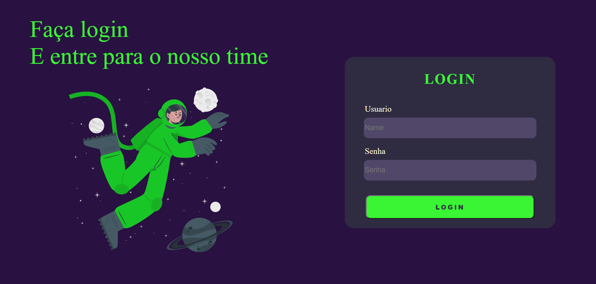

# Tela Login Dark

# Sobre o projeto
Este repositório foi criado para colocar em prática os conhecimentos adquiridos nos cursos de HTML, CSS e Javascript da <b>Digital Innovation One</b> de um projeto <b>Frontend Web</b>.

O objetivo do projeto foi recriar a interface de uma tela de login com estilo Dark utilizando tecnologias simples como <b>HTML5, CSS3 e JavaScript</b>, além de englobar os conceitos de: como estruturar um layout, técnicas de CSS3 com containers e variáveis, como posicionar os elementos com Flexbox.

# Layout do projeto

# Tecnologias utilizadas

* HTML
* CSS 
* Javascript
* Fontawesome
* Google Fonts 

# Autor

<b>Marcelo da Silva Belitardo Junior</b>

# Contatos

Linkedin: https://www.linkedin.com/in/marcelo-junior-59498210a/

email: msbcontjr@outlook.com

